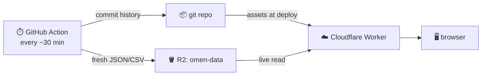

<div align="center">

# OMEN

### Is the AI capex cycle priced to keep running — or priced to break?

**One gauge. One verdict. Every threshold published so you can argue with a number instead of a black box.**

[**→ See today's verdict**](https://aititsup.com) · [The monitor](https://aititsup.com/polymarket-ai-index) · [Methodology](https://aititsup.com/methodology.html)

[](https://github.com/mishablank/omen-ai/actions/workflows/test.yml)
[](https://github.com/mishablank/omen-ai/actions/workflows/refresh.yml)
[](LICENSE)

</div>

---

Every AI-bubble take you've read is somebody's opinion. OMEN is a price.

It blends what prediction markets *think* will happen with what options, credit, volatility and equity markets are *actually charging* for protection — plus the one non-market anchor that matters, hyperscaler capex against operating cash flow, straight out of SEC XBRL. Out comes a single 0–100 crash-pressure gauge, a stated regime, and one of five verdicts.

No database. No framework. No build step. No server-side rendering. Static HTML, a handful of stdlib-only Python fetchers, and a 78-line Cloudflare Worker — the whole thing is about 11,000 lines, and every number on it comes from a free, mostly keyless endpoint.

**Not investment advice.** This is a measurement instrument, not a recommendation.

---

## 🎯 The verdict rule

The landing page exists to produce exactly one of five states. It is deterministic, published, and unit-tested cell by cell. No discretion. No vibes.

**Direction** (the Bull side's share of the Bull/Bear pair, read from 20 live Polymarket AI markets) **× Stress** (the regime, from the gauge):

|                          | 🟢 **Calm**  | 🟡 **Elevated**      | 🔴 **Stressed** |
| ------------------------ | ------------ | -------------------- | --------------- |
| **Bullish** — share ≥ 55% | Risk-on      | Constructive · hedged | Caution         |
| **Mixed** — 45–55%        | No edge      | No edge              | Caution         |
| **Bearish** — share < 45% | Risk-off     | Risk-off             | Risk-off        |

Read the bottom row carefully: **stress cannot soften a bearish read.** If the market has already picked the bear side, a quiet gauge doesn't get to talk it back down.

> Source of truth: [`omen/omen-common.js`](omen/omen-common.js) (thresholds) and [`omen/index.html`](omen/index.html) (matrix). Tested in [`omen/test-verdict.mjs`](omen/test-verdict.mjs) — all nine cells, both band edges.

## 📊 The crash-pressure gauge

Five equally-weighted families, each normalized 0–100 against a fixed calm→stress range, then averaged.

| | Family | What it reads |
| --- | --- | --- |
| **Leading**<br>*priced before the fact* | `PRED` | Polymarket bubble-burst odds |
| | `OPT` | 25Δ risk reversals, NVDA + SOXX (Nasdaq OPRA composite) |
| | `CREDIT` | HY OAS, CCC OAS, HYG drawdown, HYG/LQD ratio |
| **Confirming**<br>*moves with or after prices* | `VOL` | VIX/VIX3M term structure, VXN, SKEW, VVIX |
| | `EQUITY` | NVDA and SOXX drawdown from the running high |

**Only the leading side can warn.** That split is the entire point: a gauge that goes red because equities already fell is a thermometer, not a warning.

### Regime bands

```
STRESSED   blended gauge ≥ 55   OR   crash basket ≥ 40
ELEVATED   blended gauge ≥ 35   OR   crash basket ≥ 25   OR   any single market ≥ 15%
CALM       everything else
```

A single market — the bubble-burst market included — can raise **Elevated** but can *never* trip red on its own. That rule exists because it used to: one distress market at 35% would paint the whole board red while the blended gauge sat perfectly calm. The monitor layers two extra Stressed/Elevated triggers on top for a crash basket climbing unusually fast (z ≥ 2 with level ≥ 25, and z ≥ 1.5).

The regime chip always states *which threshold fired*, in plain English, with the live number interpolated — no pre-baked strings. That explainer has its own 13-scenario test suite.

## 🗺️ The pages

| Page | What it's for |
| --- | --- |
| [**index.html**](omen/index.html) | **The verdict.** The whole read in one viewport: pair price, gauge, regime, verdict, reasoning. |
| [**polymarket-ai-index.html**](omen/polymarket-ai-index.html) | **The monitor** — the big one, ~2,700 lines. One document, five views at `/polymarket-ai-index/<view>`: `today`, `markets`, `gpu`, `prediction-markets`, `methodology`. Includes the LEAPS tail panel: risk-neutral P(NVDA −50% / SOXX −40% in ~1y) via N(−d2) from long-dated long-dated puts — a deep-market cross-check on the thin Polymarket bubble book. |
| [**gauge.html**](omen/gauge.html) | **The gauge.** Family-by-family breakdown, leading vs confirming, 90-day reconstruction with regime bands. |
| [**indexes.html**](omen/indexes.html) | **The indexes.** Bull and Bear as one two-sided market that always sums to 1. Bull splits TECH vs CAP; Bear splits MKT vs GOV — because technology progress can survive a financial unwind, and a regulatory clampdown is not a crash. |
| [**ai-capex.html**](omen/ai-capex.html) | **AI capex.** Eight fundamentals theses — debt saturation, credit stress, equity raises, capex vs GDP, stranded >1 GW projects, the dark-fiber overcapacity analogy, FCF erosion, reflexive treasury vehicles — plus a live tape. |
| [**china-ai-monitor.html**](omen/china-ai-monitor.html) | **China substitution.** Demand for Chinese LLMs (DeepSeek, Qwen, GLM, Kimi, MiniMax, MiMo) as a leading indicator of substitution pressure on US AI equities. |
| [**influencers.html**](omen/influencers.html) | **KOL board.** Curated editorial snapshot, or auto-scored −100…+100 with evidence when `XAI_API_KEY` is set. |
| [**methodology.html**](omen/methodology.html) | **Methodology** — including the honesty section on what none of this can prove. |

## 🔌 Where the numbers come from

All free. All keyless unless marked.

| Panel | Source |
| --- | --- |
| Prediction markets, order book | Polymarket Gamma + CLOB |
| Equity / vol / credit proxies | Yahoo Finance chart API |
| 25Δ risk reversal, IV term structure | Nasdaq option chains (OPRA composite); IV + delta computed locally |
| LEAPS 1y tail — put-spread digital (Breeden–Litzenberger) | Nasdaq option chains (same windows) |
| HY OAS, CCC OAS, NFCI | FRED `fredgraph.csv` *(honest UA required)* |
| Hyperscaler capex / OCF, contracted backlog | SEC XBRL `companyconcept` *(honest UA)* |
| Insider net-selling | SEC EDGAR Form 4 (open-market S/P only) |
| Realized H100 spot rent | vast.ai public bundles API |
| Speculator positioning | CFTC Commitments of Traders (Socrata) |
| Short interest · market caps | FINRA via api.nasdaq.com · Nasdaq screener |
| Cross-venue | Kalshi, Manifold *(Metaculus: free token)* |
| TSMC monthly revenue · issuance velocity · paid adoption | TWSE OpenAPI · EDGAR full-text search · Ramp AI Index CSV |
| Generator pipeline | EIA-860M monthly workbook |
| Chinese-model demand | OpenRouter, HuggingFace, GitHub, LMArena, Vercel AI Gateway, Ollama, PyPI, Play/App Store |

A handful of fields have no free machine-readable source and are **labelled as hand-updated** rather than quietly faked: Korea 20-day semiconductor exports, PJM capacity auction clears, LBNL interconnection-queue totals, per-CUSIP TRACE spreads.

## ⚡ Run it locally

Python 3.12 stdlib and a browser. That's the entire dependency list.

```bash
python3 omen/update-market-data.py --snapshot     # fetch + append one history row
cd omen && python3 -m http.server 8844            # fetch() won't read siblings over file://
open http://localhost:8844/index.html
```

Want it to keep refreshing while you work?

```bash
python3 omen/update-market-data.py --watch 600 --snapshot
```

Open the files straight off disk and the pages fall back to `market-data.js` — the same payload delivered as a `<script src>`, because browsers block `fetch()` under `file://` but not script tags.

The other fetchers:

```bash
python3 omen/update-china-data.py    # china-data.json
python3 omen/update-capex-data.py    # capex-data.json
cd omen && npm ci && node update-app-charts.mjs
```

## ✅ Tests

```bash
python3 -m pytest omen/
```

One command, both languages, **141 tests**. `test_regime_explainer.py` shells out to the Node suites, so the browser JS is covered by the same invocation as the Python fetchers. There's no bundler, so those suites slice the functions they test out of the HTML by comment marker — and **fail loudly if a marker moves**, rather than silently testing nothing.

CI runs this on every push and pull request, plus `node --check` over the Worker and every `.mjs` file (there's no linter to lean on).

What's covered: FRED and Form 4 parsing, the server-side gauge and regime, the fetch retry policy and its sleep budget, the carry-forward policy, COT and short-interest reducers, the verdict matrix, the regime explainer's prose across 13 scenarios, and the shared module — including `safeUrl`'s rejection of `javascript:`, `data:`, and control-character scheme smuggling.

## 🚀 How it stays fresh

The most valuable output here is *accumulated history*, and that shouldn't live on a laptop.



`worker.js` runs **first** for `/market-data.json`, `/snapshots.csv`, `/influencers.json`, `/capex-data.json` and `/china-data.json` (declared under `assets.run_worker_first` in [`wrangler.jsonc`](wrangler.jsonc)) and streams them from R2 — so the dashboard is current with **no redeploy**. On an R2 miss it falls back to the bundled copy, so the site never hard-breaks during bootstrap.

It also routes the monitor's five views: `/polymarket-ai-index/<view>` serves the same document for every allowlisted view and lets the page read `location.pathname`. One fetch, instant view switching, real shareable URLs.

The pipeline runs every 30 minutes during US market hours and hourly the rest of the time:

```
fetch ──> snapshot ──> alert ──> upload to R2 ──> commit
```

**Alerts work with the browser closed.** `--alert` computes the gauge server-side and pushes only when the regime *escalates* — deduped in `alert-state.json`, so you get one ping per escalation, not one per run.

<details>
<summary><b>What gets committed each run, and why it differs per file</b></summary>

- **Every run** — `*-snapshots.csv` (append-only history that exists nowhere else), `alert-state.json` (dedup state; ephemeral CI would re-alert without it), `china-data.json` / `china-history.json` / `app-charts.json` (bundled-asset-only, so the committed copy *is* the copy the site serves), `influencers.json` / `capex-data.json` (in R2, but kilobytes, kept as a warm fallback).
- **~Weekly** — `market-data.json`. It's 171 KB rewritten in full every 30 minutes and served live from R2 anyway; committing it per run was 86% of all data churn and had pushed bot commits to 74% of repo history. It stays tracked because the Worker's R2-miss fallback needs a bundled copy at deploy time, so the Action re-seeds it only once the committed copy is over 7 days old.
- **Never** — `market-data.js`, the hand-refreshed `file://` bundle.

</details>

<details>
<summary><b>One-time deploy setup</b></summary>

```bash
npx wrangler r2 bucket create omen-data
npx wrangler deploy
npx wrangler r2 object put omen-data/market-data.json \
  --file omen/market-data.json --content-type application/json --remote
```

</details>

## 🔑 Configuration (all optional)

Every secret is optional. Without it the relevant panel degrades to a dated snapshot or hides itself — **nothing breaks.**

| Secret | Unlocks |
| --- | --- |
| `CLOUDFLARE_API_TOKEN` + `CLOUDFLARE_ACCOUNT_ID` | R2 upload (an R2-Edit token) |
| `TELEGRAM_BOT_TOKEN` + `TELEGRAM_CHAT_ID` | Regime-escalation alerts |
| `NTFY_TOPIC` | …or ntfy.sh instead |
| `METACULUS_TOKEN` | Forecaster-crowd panel (free account) |
| `XAI_API_KEY` | Auto-scored KOL board |
| `ARTIFICIAL_ANALYSIS_API_KEY` | AA scores on the China monitor |
| `CF_RADAR_TOKEN` | Cloudflare Radar panel |

Secrets are scoped to the individual workflow steps that need them — the step that runs third-party scraper code deliberately runs with **none** in scope.

## 🧠 Design rules that earned their place

Each of these is here because the alternative already cost something.

- **One price read per run.** The gauge in `market-data.json`, the row appended to `snapshots.csv`, and the regime an alert fires on all come from a *single* Polymarket fetch. Three separate fetches meant three tapes and three answers that could disagree.
- **Nothing hard-fails.** Every panel carries the previous run's value forward when its source fails, because the gauge reads those keys directly — a dropped key doesn't blank one panel, it removes a whole *family* from the mean and can flip the regime. Requests retry with exponential backoff (honouring `Retry-After`, failing fast on 4xx) under a whole-process sleep budget, so a broad outage can't stretch a 30-minute job.
- **Escaping is not URL safety.** `esc()` makes a string safe *inside* an attribute; it does nothing about the scheme, and an escaped `javascript:…` is still a live URL. Every `href` built from remote data goes through `OMEN.safeUrl`, which allowlists http/https.
- **The pages share code.** `omen-common.js` and `omen.css` exist because one page's `esc()` had quietly lost its null guard and threw where every other page degraded cleanly.
- **Sleeves are reads, not sub-indexes.** Bear is the flat equal-weight mean of all 9 constituents — not the mean of its two unequal sleeves.
- **The gauge reads MKT, not the Bear composite.** Regime bands are calibrated to priced *crash* risk. Reading the composite would let regulatory odds trip a crash regime.

## 🕳️ Known gaps

Tracked with acceptance criteria in [BACKLOG.md](BACKLOG.md). Stated here because a dashboard that hides its holes is worse than one that doesn't:

- China monitor "community mentions" (w=10) is hardcoded `null` — Reddit and X have no public, key-free, CORS-accessible API for it.
- Android chart presence rides a reverse-engineered scrape that breaks every year or two; a SerpApi fallback is specced.
- The CSS tokens still carry two parallel *names* for one palette (`--bg`/`--ink` vs `--page`/`--text-primary`).
- Chart accessibility: the SVG charts have no text alternative, direction is encoded by colour alone, and sortable table headers aren't keyboard-reachable.
- Some fundamentals fields are hand-updated, and the capex aggregate sums whichever hyperscalers reported in a given quarter — so a 4-filer quarter can sit next to a 5-filer quarter.

## 📚 More

- [**readme.txt**](readme.txt) — the full manual, in glorious ASCII.
- [**BACKLOG.md**](BACKLOG.md) — open work with acceptance criteria.
- [**docs/updates/**](docs/updates) — dated change notes.

## License

[Boost Software License 1.0](LICENSE).

---

<div align="center">

**Not investment advice.**

*This is a measurement instrument, not a recommendation.*<br>
*Every threshold is published so you can disagree with a number rather than with a black box.*

</div>
